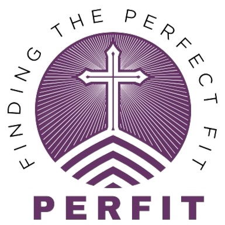

<div align="center">
  
  <h1>PERFIT</h1>
  <p><strong>Ministry Fit Assessment Platform</strong></p>
  <p>
    <em>Helping volunteers discover where they best serve.</em>
  </p>
</div>

---

PERFIT is a web-based assessment tool that helps church volunteers identify which ministries best match their **skills, interests, and personality**. Admin users configure restriction rules and question sets; volunteers take an assessment and receive a personalized ministry fit report.

## Features

- **Volunteer Assessment** — Multi-step questionnaire covering skills, interests & passion, and behavioral traits (English and Filipino)
- **Admin Panel** — Dashboard with analytics, restrictions editor, question editor, and settings
- **Restriction Editor** — Set demographic and skill requirements per ministry (age, gender, marital status, skills, etc.)
- **Question Editor** — Manage skill questions, interest & passion questions, and behavioral questions with EN + TL variants
- **Church Code System** — Each church gets a unique code for volunteer registration
- **User Reports** — Generate detailed ministry fit reports for volunteers
- **Export** — Generate admin reports (PDF)

## Tech Stack

| Layer | Technology |
|-------|-----------|
| **Framework** | Laravel 12 |
| **Frontend** | Blade, Tabler, Vite |
| **Database** | SQLite / MySQL |
| **Icons** | Tabler Icons |
| **Charts** | Chart.js |

## Prerequisites

- PHP 8.2+
- Composer
- Node.js 20+
- SQLite or MySQL

## Setup

```bash
# Clone the repository
git clone <repo-url> perfit
cd perfit

# Install PHP dependencies
composer install

# Install Node dependencies
npm install

# Environment setup
cp .env.example .env
php artisan key:generate

# Database setup (SQLite default)
touch database/database.sqlite
php artisan migrate --seed

# Build frontend
npm run build
```

## Development

```bash
# Start all dev servers (Vite + Laravel + Queue + Logs)
composer run dev
```

Or run individually:

```bash
php artisan serve           # Laravel dev server
npm run dev                 # Vite HMR
php artisan queue:listen    # Queue worker
php artisan pail            # Log viewer
```

## Available Scripts

| Command | Description |
|---------|-------------|
| `composer run dev` | Start all dev servers concurrently |
| `composer run build` | Build frontend assets |
| `composer run test` | Run tests |
| `npm run dev` | Vite HMR |
| `npm run build` | Vite production build |

## Project Structure

```
app/
  Http/
    Controllers/
      Auth/       # Login, Register, ForgotPassword, Logout
      FrontendController.php
  Models/         # User, Ministry, Skill, Reports, Restrictions, Questions
config/
database/
  migrations/     # 10 migration files
  seeders/        # Ministry categories, ministries, skills
public/
  images/         # Static assets (logos, banners)
resources/
  css/            # app.css (Tabler + custom styles)
  views/
    _layouts/     # master.blade.php, admin.blade.php
    _partials/    # Side nav components
    admin/        # Dashboard, login, restrictions, questions, settings
    Index.blade.php  # Landing page
routes/
  web.php         # Public + Admin routes
```

## Routes

### Public
| URI | Name | Description |
|-----|------|-------------|
| `/` | `home` | Landing page |
| `/ministries` | `ministries` | Ministry info |
| `/privacy-policy` | `privacy-policy` | Privacy policy |

### Admin Auth
| URI | Name | Description |
|-----|------|-------------|
| `/admin/login` | `admin.login` | Login page |
| `/admin/register` | — | Registration (API) |

### Admin Panel (authenticated)
| URI | Name | Description |
|-----|------|-------------|
| `/admin/dashboard` | `admin.dashboard` | Analytics dashboard |
| `/admin/restrictions` | `admin.restrictions` | Restriction editor |
| `/admin/questions` | `admin.questions` | Question editor |
| `/admin/settings` | `admin.settings` | Church settings |
| `/admin/logout` | `admin.logout` | Logout |

## Development Status

> This project is a migration from a legacy PHP/jQuery codebase to Laravel 12.

| Area | Status |
|------|--------|
| Database | ✅ Complete (migrations, models, seeders) |
| Public Pages | 🔧 In progress (landing, ministry info) |
| Admin Layout & Nav | ✅ Complete |
| Assessment | ❌ Not started |
| User Reports | ❌ Not started |
| Export | ❌ Not started |

## License

This project is proprietary. All rights reserved.
